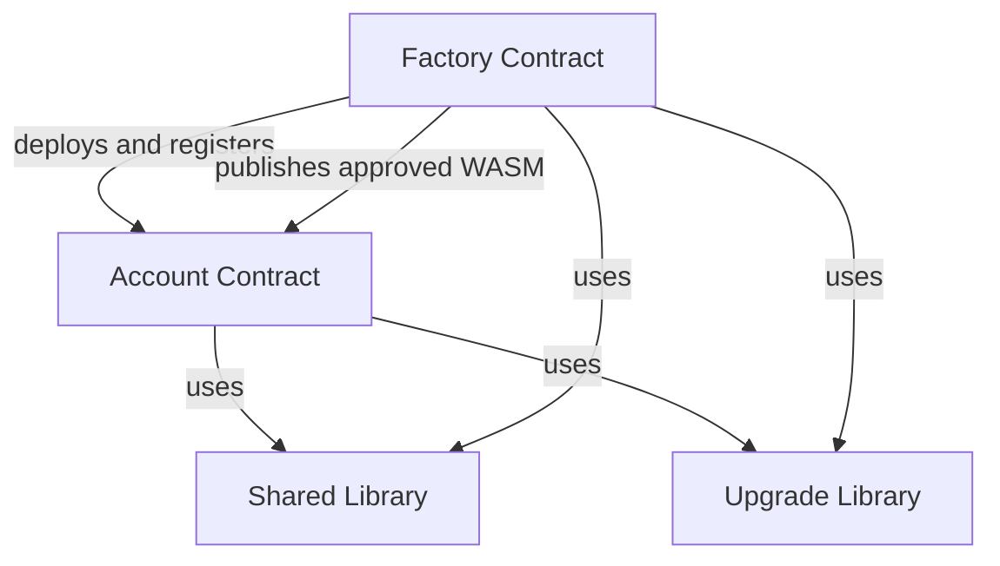

# SocketFi

**SocketFi** is modular smart account infrastructure built on Soroban (Stellar). It enables applications to provide embedded, self-custodial accounts with passkeys, Stellar and EVM signers, guardian-assisted recovery, programmable sessions, and native Soroban authorization.

## Overview

SocketFi provides reusable contracts and libraries for:

- Deterministic smart account deployment
- Passkey, Stellar, and EVM account signers
- Soroban `CustomAccountInterface` authorization
- Scoped and expiring session policies
- Guardian-assisted BLS account recovery
- Emergency pause controls
- Signer rotation and global session invalidation
- Factory-published, account-authorized upgrades
- Shared types, validation, storage, and cryptographic helpers

Each package has a focused responsibility and remains composable with the rest of the protocol.

## Architecture

### Factory Contract

The Factory is responsible for:

- Deploying and initializing new Account contracts
- Supporting deterministic account deployment
- Registering canonical SocketFi accounts
- Storing the latest approved Account WASM hash and version
- Managing protocol-level deployment and upgrade configuration

The Factory may publish an approved Account implementation, but it does not silently replace an account's code. Adoption of an upgrade remains subject to Account authorization.

### Account Contract

The Account is the primary smart account implementation. It provides:

- Passkey, Stellar ed25519, or EVM secp256k1 owner authentication
- Soroban-native `__check_auth` integration
- Authenticated contract invocations and multi-operation execution
- Scoped session authorization
- Multiple concurrent sessions
- Individual and global session revocation
- Account signer rotation
- Guardian-assisted BLS recovery
- Emergency pause and controlled unpause
- Guardian management
- Owner-authorized upgrades and versioned migrations

An Account has one active owner-signing method at a time. Sessions are delegated authorizations and do not replace the active Account signer.

### Shared Library

The Shared package contains reusable protocol functionality, including:

- Contract interfaces
- Shared types and errors
- Authentication and authorization helpers
- Passkey, Stellar, EVM, and BLS-related types
- Token and invocation helpers
- Serialization and hashing helpers
- Storage utilities
- Common validation logic

### Upgrade Library

The Upgrade package provides reusable upgrade and migration utilities, including:

- Upgrade authorization helpers
- Approved-WASM validation
- Contract version management
- Migration guards
- Storage compatibility patterns
- Upgrade and migration events

## Contract Relationships



## Key Features

### Multi-Signer Accounts

An Account can be initialized with one supported owner-signing method:

- **Passkey** — WebAuthn P-256 authentication
- **Stellar signer** — ed25519 authentication
- **EVM signer** — secp256k1 authentication compatible with EVM account

Signer proof of possession is verified before a signer is installed. Rotation and recovery replace the active signer atomically.

### Native Soroban Authorization

The Account implements Soroban's `CustomAccountInterface`. Authenticated invocations pass through `__check_auth`, which:

- Selects the appropriate authentication method
- Confirms that the submitted signer is active
- Validates authorization contexts
- Enforces pause and session restrictions
- Verifies the supplied signature
- Refreshes Account instance storage TTL on successful use

### Programmable Sessions

Session policies allow an Account to delegate narrowly scoped transaction authority without repeatedly requesting the owner signature.

A policy can define constraints such as:

- Authorized delegate
- Allowed contracts and functions
- Expiration ledger
- Spend limits
- Usage limits
- Account session epoch

Each session is stored under its own policy ID, so multiple sessions can remain active concurrently. Creating one session does not revoke existing sessions.

Sessions can be invalidated through:

- Individual policy revocation
- Policy expiration
- Exhausted spend or usage limits
- Global session-epoch changes
- Account signer rotation
- Account recovery

Session events can be indexed off-chain to provide history, pagination, and account activity views without maintaining an unbounded on-chain session list.

### Guardian Recovery

Guardian recovery allows the active Account signer to be replaced when the original authentication method is unavailable or compromised.

The recovery design uses:

- Guardian BLS public keys with proof of possession
- A stored aggregated BLS recovery key
- A domain-separated recovery payload
- A replacement-signer proof of possession
- An aggregated BLS recovery signature
- Session-epoch invalidation after successful recovery

Recovery changes the Account signer but preserves the Account address and assets.

### Emergency Protection

Guardians can help protect a compromised Account through:

- Emergency pause
- Guardian approval for unpause
- Delayed guardian removal
- Recovery to a new Account signer

While paused, normal Account operations and delegated session use are restricted according to the Account's authorization rules.

### Upgradeability

SocketFi uses an opt-in upgrade model:

1. The Factory publishes an approved Account WASM hash and version.
2. The Account compares its installed version with the approved version.
3. The active Account signer authorizes adoption.
4. The Account updates its WASM.
5. A versioned migration runs when state changes are required.

Sessions must not be allowed to authorize Account upgrades. Existing storage keys and encoded types must remain backward-compatible unless an explicit migration safely transforms them.

## Account Lifecycle

### Deployment

1. A user or application selects an Account signer.
2. The signer proves possession of the relevant private key or passkey.
3. Guardian BLS keys and proofs of possession are provided.
4. The Factory deterministically deploys the Account.
5. The Account validates and stores its initial configuration.
6. The Factory registers the deployed Account.

### Normal Authorization

1. An application constructs a Soroban transaction.
2. The Account receives Soroban authorization contexts.
3. `__check_auth` validates the contexts and Account state.
4. The selected authentication method verifies the signature.
5. Soroban executes the authorized invocation atomically.

### Session Authorization

1. The active Account signer authorizes creation of a session policy.
2. The policy is stored under a unique policy ID.
3. The delegate signs an invocation using that session.
4. The Account validates the policy, epoch, expiry, scope, and limits.
5. The invocation executes only when every policy constraint succeeds.

### Rotation and Recovery

- **Rotation** is authorized by the current Account signer and installs a new signer after proof-of-possession validation.
- **Recovery** is authorized by the configured recovery authority and installs a new signer without requiring the previous signer.

Both operations increment the session epoch so previously issued sessions cannot remain valid after control of the Account changes.

## Workspace Structure

```text
socketfi/
├── account/
├── factory/
├── shared/
├── upgrade/
├── Cargo.toml
├── LICENSE
└── README.md
```

## Development

### Requirements

- Rust stable
- Cargo
- Soroban CLI
- A compatible Soroban SDK version
- WebAssembly compilation target

Install the WASM target:

```bash
rustup target add wasm32v1-none
```

### Build

Build the workspace:

```bash
cargo build --workspace
```

Build optimized Soroban contracts:

```bash
stellar contract build
```

### Test

Run all workspace tests:

```bash
cargo test --workspace
```

Run tests for an individual package:

```bash
cargo test -p account
cargo test -p factory
```

### Format and Lint

```bash
cargo fmt --all --check
cargo clippy --workspace --all-targets -- -D warnings
```

Package names and commands should be adjusted if the workspace uses prefixed Cargo package names such as `socketfi-account`.

## Security Model

SocketFi's security depends on the combined enforcement of:

- Proof of possession during signer registration
- Domain-separated signed payloads
- Authorization-context validation
- Exactly one active Account signer
- Strict session scope and lifetime checks
- Session exclusion from privileged lifecycle operations
- Global session invalidation after rotation or recovery
- Guardian BLS proof-of-possession validation
- Emergency pause controls
- Delayed guardian removal
- Owner authorization for upgrades
- Versioned and storage-compatible migrations
- Soroban's atomic transaction execution

Smart contract software is inherently risky. Production deployments should use reproducible builds, independent security audits, protected Factory administration, monitored upgrade releases, and comprehensive property and integration tests.

## Design Principles

- **Self-custody** — Account ownership is enforced by user-controlled signing methods.
- **Modularity** — Contracts and libraries have focused responsibilities.
- **Least privilege** — Sessions receive only the authority required for their intended task.
- **Recoverability** — Guardian recovery can restore access without changing the Account address.
- **Explicit upgrades** — The Factory publishes approved versions; Accounts authorize adoption.
- **Composability** — Accounts use Soroban-native authorization and can interact with the broader Stellar ecosystem.
- **Determinism** — Deployment, authentication payloads, and authorization behavior are reproducible.
- **Maintainability** — Shared libraries reduce duplication and keep validation consistent.

## Events and Indexing

Contracts should publish structured events for important state transitions, including:

- Account deployment
- Session creation and revocation
- Global session-epoch changes
- Account signer rotation
- Account recovery
- Pause and unpause
- Guardian addition and removal
- Upgrade and migration

Events improve observability and enable account history, session management, analytics, and alerting. On-chain storage remains authoritative for authorization decisions.

## Notes

- Account deployment is permissionless unless the Factory explicitly applies a deployment policy.
- Each Account stores the Factory address used for approved-version discovery.
- The Factory registry identifies canonical SocketFi deployments.
- An Account can support multiple concurrent session policies.
- Sessions cannot perform signer rotation, recovery, guardian administration, or upgrades unless explicitly and safely designed otherwise.
- Account storage TTL is refreshed through successful externally reachable execution paths.
- Recovery does not require the previous Account signer.
- Upgrading does not rerun the constructor.

## License

Licensed under the Apache License 2.0. See [LICENSE](LICENSE) for details.
