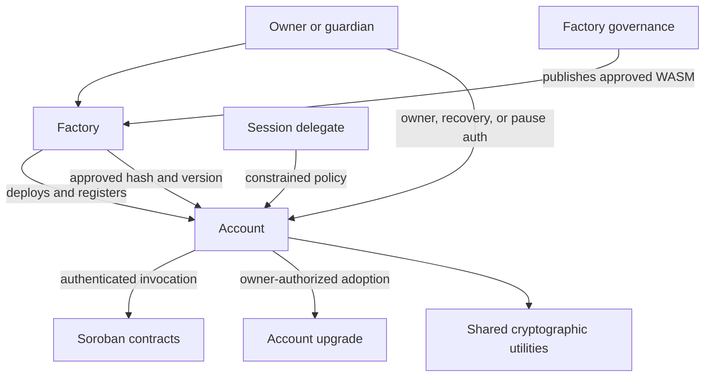

# SocketFi Smart Account Protocol Threat Model

**System:** SocketFi Smart Account Protocol  
**Scope:** Factory • Account • Shared • Upgrade • Session Authorization  
**Methodology:** STRIDE  
**Audience:** Security reviewers • External auditors • Protocol engineers  
**Status:** Living document

---

## 1. Overview

SocketFi is a modular smart account protocol built on Soroban (Stellar). It
provides self-custodial accounts with mutually exclusive owner authentication
through a passkey, a Stellar Ed25519 signer, or an EVM secp256k1 signer.

Accounts can delegate constrained authority to multiple concurrent sessions.
Recovery is authorized by a configured aggregate BLS recovery key backed by
guardian proofs of possession. Guardian controls provide emergency pause and
controlled unpause behavior.

The Factory deploys accounts, records canonical deployments, and publishes the
currently approved Account WASM. An account stores its originating Factory
address, but adoption of a Factory-approved implementation remains authorized
by the account owner. The Factory must not be able to silently replace account
authentication logic.

The protocol contains four principal packages:

- **Factory** — deployment, creation replay protection, account registry, and
  approved implementation governance.
- **Account** — owner authentication, session authorization, signer rotation,
  recovery, guardian controls, pause state, and `CustomAccountInterface`.
- **Shared** — common types, errors, events, authentication helpers, WebAuthn,
  Ed25519, secp256k1/EVM, and BLS utilities.
- **Upgrade** — proposal, voting, version, migration, and upgrade utilities.

---

## 2. Security Objectives

### Owner authentication

Only the currently configured owner signer may authorize unrestricted account
operations. Authentication mechanisms must not be confused with one another.

### Delegated authorization

A session may authorize only the functions, assets, amounts, destinations,
usage count, and lifetime explicitly granted by its policy.

### Recovery

Recovery must require a valid aggregate BLS authorization and valid proof of
possession from the replacement signer. Recovery must invalidate all previously
issued sessions.

### Integrity

Account, session, guardian, Factory, governance, version, and migration state
must change only through authorized, atomic protocol flows.

### Availability

TTL management, pause controls, recovery, and guardian lifecycle rules must
protect account availability without allowing indefinite unauthorized liveness
or permanent denial of service.

### Upgrade safety

The Factory may publish approved Account implementations, but an individual
account upgrade must require owner authorization. Sessions must never authorize
upgrades or migrations.

### Auditability

Security-relevant transitions must emit sufficient events for monitoring and
forensic reconstruction. Events and indexers are informational and must never
replace on-chain authorization.

---

## 3. Architecture



---

## 4. Critical Assets

| Domain               | Assets                                                                                                      |
| -------------------- | ----------------------------------------------------------------------------------------------------------- |
| Owner authentication | Active signer type; passkey; RP ID hash; Stellar public key; EVM address; authentication signatures         |
| Sessions             | Policy ID; delegate key; session epoch; allowlist; spend and usage limits; expiry; session signatures       |
| Recovery             | Aggregate BLS public key; guardian BLS proofs of possession; recovery signatures; recovery challenge/domain |
| Guardian controls    | Guardian set; removal schedule; pause state; unpause approval                                               |
| Account state        | Assets; factory address; initialization state; installed WASM/version; storage TTL                          |
| Factory              | Creation nonce; canonical account registry; approved Account WASM hash and version                          |
| Governance           | Administrator/voter set; proposals; votes; quorum; execution state                                          |
| Audit data           | Authentication, session, recovery, guardian, pause, deployment, and upgrade events                          |

Private passkey material, Stellar private keys, EVM private keys, session private
keys, and guardian BLS secret keys are off-chain assets. Their compromise is
nevertheless part of the operational threat model.

---

## 5. Trust Boundaries

| Boundary                            | Security expectation                           | Primary risks                                     |
| ----------------------------------- | ---------------------------------------------- | ------------------------------------------------- |
| Owner client → Account              | Correct domain-bound owner signature           | Forgery, replay, signer-type confusion            |
| Session delegate → Account          | Policy-constrained authorization               | Policy bypass, replay, accounting errors          |
| Guardian/recovery service → Account | Valid aggregate recovery authorization         | Rogue-key attack, replay, quorum compromise       |
| Guardian → Account pause controls   | Correct guardian identity and state transition | DoS, unauthorized unpause                         |
| Factory → Account                   | Correct deployment and approved-upgrade data   | Malicious initialization, false upgrade data      |
| Governance → Factory                | Authorized, ordered governance execution       | Voter compromise, replay, premature execution     |
| Account → external contracts        | Exact authorization-tree validation            | Nested invocation or argument substitution        |
| Events → indexer/UI                 | Accurate derived view                          | Missing events, reorg/ingestion lag, stale status |
| Storage → ledger TTL                | State remains live as designed                 | Expiration, inconsistent TTL extension            |

---

## 6. Entry Points and Attack Surface

The exact exported names may vary by implementation; audit the deployed
contract interface as authoritative.

### Factory

- Constructor and administrator initialization
- Account challenge/nonce generation
- Account deployment and initialization
- Canonical account registration
- Account WASM upload/reference management
- Upgrade proposal, voting, and execution
- Approved Account WASM/version read functions

### Account

- `__constructor`
- `__check_auth`
- Owner signer rotation
- `recover_account`
- Session creation, use, individual revocation, and global revocation
- Guardian addition and delayed removal
- Pause, approve-unpause, and unpause
- Upgrade and migration
- Account/security-state read functions

### Shared and Upgrade

These packages may not expose independent contract entry points, but defects in
their parsing, cryptographic verification, serialization, voting, versioning,
or migration logic affect every caller.

---

## 7. STRIDE Threat Register

| ID  | Category               | Threat                                                                                    | Impact                                | Severity | Principal controls                                                                               |
| --- | ---------------------- | ----------------------------------------------------------------------------------------- | ------------------------------------- | -------- | ------------------------------------------------------------------------------------------------ |
| S1  | Spoofing               | Forged WebAuthn/P-256 assertion                                                           | Unauthorized account execution        | Critical | P-256 verification, RP ID binding, challenge binding, strict authenticator parsing               |
| S2  | Spoofing               | Forged Stellar Ed25519 signature                                                          | Unauthorized account execution        | Critical | Ed25519 verification over the exact Soroban payload                                              |
| S3  | Spoofing               | Forged or malleable EVM signature                                                         | Unauthorized account execution        | Critical | Keccak domain construction, recovery-ID validation, low-`s` policy, recovered-address comparison |
| S4  | Spoofing               | Signer-type or signature-domain confusion                                                 | Cross-mechanism authorization bypass  | Critical | Tagged auth enum, distinct POP and operation domains, exact payload encoding                     |
| S5  | Spoofing               | Forged session delegate signature                                                         | Delegated unauthorized execution      | Critical | Session-key signature verification and policy-ID binding                                         |
| S6  | Spoofing               | Forged aggregate BLS recovery signature                                                   | Account takeover                      | Critical | Aggregate verification, POP validation, domain separation                                        |
| S7  | Spoofing               | Unauthorized guardian, admin, or governance voter                                         | Pause abuse or malicious upgrades     | Critical | `require_auth`, canonical stored identities, bounded voter/guardian sets                         |
| T1  | Tampering              | Owner signer changed without current-owner authorization or recovery proof                | Account takeover                      | Critical | Authorized rotation, replacement POP, atomic signer replacement                                  |
| T2  | Tampering              | More than one owner signer remains active                                                 | Ambiguous or unintended authority     | Critical | Clear all active signers, install exactly one, invariant tests                                   |
| T3  | Tampering              | Session policy arguments, counters, epoch, or expiry bypassed                             | Excess delegated spending/authority   | Critical | Canonical policy hashing, context validation, checked accounting                                 |
| T4  | Tampering              | Guardian set or aggregate key becomes inconsistent                                        | Recovery loss or takeover             | Critical | Atomic guardian/key update, duplicate rejection, POP revalidation                                |
| T5  | Tampering              | Account initialization or creation challenge replay                                       | Duplicate/invalid deployment state    | High     | One-time constructor, nonce/challenge consumption, factory registry                              |
| T6  | Tampering              | Unauthorized WASM replacement or downgrade                                                | Full account compromise               | Critical | Factory-approved hash/version plus owner authorization; monotonic versions                       |
| T7  | Tampering              | Unsafe migration corrupts or reinterprets storage                                         | Frozen account or auth bypass         | Critical | Version-gated, idempotent migrations and compatibility tests                                     |
| T8  | Tampering              | Factory address or installed-version state is mutable                                     | Upgrade-source substitution           | Critical | Constructor-only immutable Factory address; protected version state                              |
| R1  | Repudiation            | Missing or ambiguous security events                                                      | Weak monitoring and forensics         | Medium   | Structured events containing account, policy/version IDs, and state transition                   |
| R2  | Repudiation            | Indexer incorrectly marks a session active/revoked                                        | Misleading UI or operational response | Medium   | On-chain state is authoritative; reconcile policy existence, epoch, limits, and expiry           |
| I1  | Information disclosure | Public guardian/session metadata reveals relationships or usage                           | Privacy loss, targeting               | Medium   | Minimize event fields; avoid emitting unnecessary personal metadata                              |
| I2  | Information disclosure | WebAuthn client data or authenticator data leaks more than required                       | Privacy/fingerprinting                | Low      | Store only required verification state; avoid logging assertions                                 |
| D1  | Denial of service      | Malicious or compromised guardian pauses account                                          | Temporary loss of use                 | High     | Explicit unpause/recovery path, monitored guardian actions                                       |
| D2  | Denial of service      | Guardian removal or recovery configuration abuse                                          | Recovery unavailable                  | High     | Delayed removal, limits, owner auth, atomic key recomputation                                    |
| D3  | Denial of service      | Instance or temporary storage expires                                                     | Account/session unavailable           | High     | One instance TTL bump per successful external path; policy-specific TTL                          |
| D4  | Denial of service      | Unbounded inputs, contexts, guardians, or policies exhaust resources                      | Invocation failure/cost increase      | High     | Strict maximum lengths, bounded loops and batch sizes                                            |
| D5  | Denial of service      | Governance prevents or forces security upgrade availability                               | Accounts remain vulnerable            | High     | Timelock/quorum, transparent proposals, owner choice, emergency plan                             |
| E1  | Elevation of privilege | `__check_auth` accepts forbidden authorization contexts                                   | Full account compromise               | Critical | Strict context/function/argument validation                                                      |
| E2  | Elevation of privilege | Session authorizes signer, guardian, recovery, upgrade, migration, or session-admin calls | Full account compromise               | Critical | Deny sensitive functions independently of configurable allowlists                                |
| E3  | Elevation of privilege | Paused account still performs arbitrary operations                                        | Pause bypass                          | Critical | Central pause enforcement with narrow explicit exceptions                                        |
| E4  | Elevation of privilege | Factory gains unilateral upgrade authority                                                | Protocol-wide custodial takeover      | Critical | Account self-auth required for adoption; no Factory-only account upgrade                         |
| E5  | Elevation of privilege | Nested Soroban authorization tree differs from signed intent                              | Unauthorized downstream call          | Critical | Validate complete auth contexts, target contracts, functions, and arguments                      |
| E6  | Elevation of privilege | Integer overflow, unit mismatch, or duplicate context bypasses session limits             | Excess session authority              | Critical | Checked arithmetic, canonical asset units, duplicate rejection                                   |

Severity is the expected worst-case impact before considering implementation-
specific control effectiveness. Likelihood and residual severity should be
assigned during code review and deployment review.

---

## 8. Authentication-Specific Analysis

### 8.1 Passkey authentication

The verifier must bind the signature to the exact Soroban
`signature_payload`, expected RP ID hash, and supported WebAuthn ceremony.
Client-data parsing must reject malformed, duplicated, ambiguous, or
unsupported fields. Authenticator flags required by policy must be enforced.

Proof of possession used during initialization, rotation, or recovery must use
a domain distinct from ordinary transaction authentication.

### 8.2 Stellar authentication

Ed25519 verification must operate on the exact 32-byte payload defined by the
account interface. The stored public key and any human-readable Stellar address
must not diverge. Replacement-signer POP must be bound to the target account,
network, operation, and challenge.

### 8.3 EVM authentication

The contract must define whether it accepts an EIP-191-style
`personal_sign` digest or another explicit scheme and reproduce it exactly.
Validate the recovery ID, enforce the intended signature-canonicalization
policy, recover the uncompressed key, derive the 20-byte address from
`keccak256(X || Y)`, and compare it with the stored address.

Chain/network-independent signatures create replay risk unless the signed
domain also binds the Soroban network and target account.

### 8.4 Session authentication

Each session is stored under a unique policy ID and may coexist with other
sessions. Creation of one session must not increment the global epoch or revoke
unrelated policies.

Authorization must verify:

- Policy existence in on-chain storage
- Delegate signature
- Policy ID and current session epoch
- Expiration ledger
- Target contract, function, and complete authorization context
- Asset, amount, recipient, spend, and usage restrictions
- Checked updates to stateful counters
- Pause state

Session policy configuration must never permit sensitive account-administration
functions, even if a caller attempts to include them in an allowlist.

Individual revocation removes the selected policy. Global revocation,
owner-signer rotation, and recovery increment the session epoch so old sessions
become invalid without iterating over them.

Temporary session storage may expire automatically. An indexer can enumerate
session history from events, but the contract cannot query events and the UI
must not treat indexed status as authorization truth.

---

## 9. Recovery and Guardian Analysis

Every BLS public key added to an aggregate set must provide proof of possession
to prevent rogue-key attacks. The recovery message must be domain-separated and
bind at least:

- Soroban network
- Account address
- Recovery operation
- Current recovery nonce or non-replayable challenge
- Replacement signer type and key/address
- Any new RP ID hash

After all recovery authorization and replacement POP checks succeed, the
contract clears every active owner signer and installs exactly one replacement.
Soroban atomicity must ensure that a failure cannot leave the account without a
signer or with multiple signers.

Recovery must invalidate all prior sessions. Whether recovery also changes the
guardian set or aggregate BLS key must be explicit; unchanged recovery
configuration should be documented and tested.

Guardian pause, unpause approval, delayed removal, and aggregate-key updates
must have clearly separated authorization rules. A guardian who may pause
should not automatically gain unrestricted recovery or upgrade authority.

---

## 10. Deployment and Factory Analysis

Account creation must be permissionless without allowing challenge replay,
address collision, constructor substitution, or registration of noncanonical
accounts.

Each account stores its Factory address once during construction. This value
enables it to retrieve the approved Account WASM and version, but the stored
address alone does not prove that the official Factory deployed the account.
Integrations should verify both:

```text
account.factory() == expected_factory
AND
expected_factory.is_registered_account(account) == true
```

The Factory registry, constructor arguments, deployment salt, creation nonce,
network, and resulting account address should be covered by tests and emitted
events.

---

## 11. Upgrade and Migration Analysis

Recommended authority model:

1. Governance approves and publishes an Account WASM hash and increasing
   version through the Factory.
2. The account reads the approved hash/version from its immutable Factory.
3. The account owner authorizes adoption through the account’s normal owner
   authentication.
4. Session authorization is rejected.
5. The account calls `update_current_contract_wasm`.

The Factory must not possess a unilateral per-account upgrade path. Otherwise,
Factory governance can replace authentication logic and seize every account.

Upgrade controls must address:

- Uploaded WASM hash existence and exact equality
- Monotonic version progression and downgrade rejection
- Proposal replay and double execution
- Quorum, timelock, voter-set mutation, and emergency procedures
- Storage-key and encoded-type compatibility
- Constructor not executing again after upgrade
- Migration authorization, ordering, idempotence, and rollback behavior
- Events containing previous/new versions and new WASM hash

Do not rely exclusively on a locally stored `InstalledWasm` value as proof of
the host-installed code unless the protocol updates it atomically and tests
that assumption. Prefer explicit contract versions for migration decisions and
Factory-approved hashes for eligibility.

---

## 12. Pause-State Matrix

The implementation should define and test a single authoritative matrix.
Recommended behavior:

| Operation while paused                  | Recommended result                                         |
| --------------------------------------- | ---------------------------------------------------------- |
| Arbitrary owner-authenticated execution | Deny                                                       |
| Session execution                       | Deny                                                       |
| Create or modify session                | Deny                                                       |
| Rotate owner signer                     | Deny unless explicitly part of emergency design            |
| Guardian pause                          | Idempotent or deny as already paused                       |
| Approve unpause                         | Allow under guardian rules                                 |
| Unpause                                 | Allow only with owner auth plus required guardian approval |
| Recover account                         | Allow as an emergency path                                 |
| Adopt upgrade/migrate                   | Explicit policy required; default deny                     |
| Read-only query                         | Allow                                                      |

Any exception must be narrow and documented. Pause checks distributed across
individual functions are prone to omission; central enforcement plus
entry-point tests is preferred.

---

## 13. Storage and TTL Risks

Account-wide configuration stored in instance storage expires together.
`bump_instance(&env)` should execute once on every successful externally
reachable path that is expected to keep the account alive, including
`__check_auth`. Failed calls roll back state and TTL changes and therefore must
not let an attacker extend account lifetime.

Internal storage helpers should not independently bump instance TTL when their
public callers already do so. Session policies in temporary storage require
their own correctly calculated TTL and must not outlive the policy’s authorized
expiration.

Audit:

- Threshold and extension constants
- Ledger/time conversion assumptions
- Constructor TTL initialization
- Direct guardian/recovery paths that may not invoke `__check_auth`
- Upgrade/migration persistence
- Behavior when account or session entries are near expiration

---

## 14. Security Invariants

The following properties must hold for every reachable state:

1. Account initialization succeeds at most once.
2. Exactly one owner signer type is active after initialization, rotation, or
   recovery.
3. RP ID state exists only when required by the active passkey design and is
   updated consistently during signer replacement.
4. Unrestricted execution requires valid current-owner authentication.
5. Every auth mechanism verifies the exact Soroban signature payload under its
   own explicit domain and encoding.
6. Sessions cannot authorize owner-signer, recovery, guardian, pause-control,
   session-administration, upgrade, or migration functions.
7. A session cannot exceed any policy function, target, recipient, asset,
   amount, spend, usage, epoch, or expiry constraint.
8. Creating a new session does not revoke existing sessions.
9. Individual revocation affects only the selected session.
10. Global revocation, signer rotation, and recovery invalidate all prior
    sessions through an epoch change.
11. Recovery requires a valid aggregate BLS authorization and valid
    replacement-signer POP.
12. Duplicate guardians and invalid/duplicate BLS keys cannot be configured.
13. Guardian count and all caller-controlled vectors remain within fixed
    protocol limits.
14. Paused accounts cannot perform arbitrary or session-authorized execution.
15. The Factory address is immutable after construction.
16. Creation challenges/nonces cannot be replayed.
17. The Factory registry identifies canonical SocketFi accounts.
18. Only a Factory-approved, newer Account WASM may be adopted.
19. Each account upgrade requires owner authorization; Factory authorization
    alone is insufficient.
20. Migrations are version-gated and cannot execute twice for the same
    transition.
21. Failed invocations leave signer, session, guardian, version, and TTL state
    unchanged.

---

## 15. Required Events and Monitoring

Emit structured events for:

- Account deployed and registered
- Owner signer rotated
- Account recovered
- Session created
- Session individually revoked
- All sessions invalidated / epoch changed
- Guardian added
- Guardian removal scheduled and finalized
- Account paused, unpause approved, and unpaused
- Upgrade approved by governance
- Account upgraded
- Migration completed

Avoid publishing full authentication assertions or unnecessary personal
metadata. Monitoring should alert on recovery, signer replacement, pause,
governance changes, and upgrades.

Session listings may be built from events, but current usability must be
confirmed against on-chain policy existence, current epoch, expiry, and limits.

---

## 16. Abuse Cases

### Cross-auth replay

An attacker submits a valid POP or EVM-signed digest as ordinary account
authorization, or reuses a signature on another network/account.

**Controls:** Distinct domain tags, target-account and network binding, tagged
signature variants, exact message construction.

### Session escalation

A delegate creates a nested invocation or manipulated context that appears to
call an allowed function while authorizing an upgrade, transfer, or other
forbidden downstream action.

**Controls:** Validate the complete authorization tree and arguments; maintain
an unconditional sensitive-function denylist.

### Recovery replay

An attacker reuses a previously valid aggregate BLS signature after the owner
has already recovered.

**Controls:** Recovery nonce/challenge consumption and binding to the exact
replacement signer and account.

### Rogue BLS key

A malicious guardian registers a key constructed relative to honest keys and
later forges an aggregate authorization.

**Controls:** Verify proof of possession for every registered BLS public key
before aggregation.

### Factory governance compromise

Governance publishes malicious Account WASM.

**Controls:** Multisig/quorum, timelock, public artifact verification, audit
period, owner-approved adoption, and downgrade rejection. Owners may decline
the upgrade.

### TTL expiration

An account used only through an unbumped direct path, or a session with an
incorrect temporary TTL, expires unexpectedly.

**Controls:** Entry-point TTL coverage tests, constructor initialization,
policy-specific TTL tests, and operational monitoring.

### Indexer desynchronization

The UI reports a session as active after expiry or a global epoch change.

**Controls:** Treat indexed events as discovery/history only and confirm
authorization-relevant status on-chain.

---

## 17. Assumptions

- Soroban correctly implements contract atomicity, authorization trees,
  cryptographic host functions, storage TTL, and `CustomAccountInterface`.
- Stellar consensus and network passphrases behave as specified.
- Audited WASM corresponds exactly to the hash published by Factory governance.
- Client software signs the exact domain and payload requested by the protocol.
- Owner, session, guardian, administrator, and governance secret keys are
  generated and stored securely.
- External contracts invoked by an account may still be malicious; account
  authentication does not make downstream application logic safe.

---

## 18. Out of Scope

Unless separately reviewed, this document does not fully assess:

- Frontend, backend, relayer, database, or indexer implementation security
- Browser, operating-system, authenticator, or hardware-wallet security
- Phishing and user-interface transaction interpretation
- Guardian key custody and off-chain coordination infrastructure
- Soroban runtime, Stellar consensus, or underlying cryptographic primitives
- Security of arbitrary third-party contracts or tokens invoked by an account
- Governance organization, legal controls, or personnel processes

Interfaces with these systems remain in scope where malformed or adversarial
input crosses into the contracts.

---

## 19. Residual Risks

- Compromise of the active owner signer permits owner-authorized operations
  until pause or recovery.
- Compromise of sufficient BLS recovery authority may permit account takeover.
- A compromised guardian may cause temporary denial of service through pause.
- Compromised Factory governance may publish malicious code, although owner
  authorization prevents silent adoption under the recommended model.
- Users may remain on vulnerable older Account implementations.
- WebAuthn, Ed25519, secp256k1, Keccak, or BLS implementation defects may defeat
  authentication assumptions.
- Public guardian and session activity may reveal behavioral metadata.
- Operational TTL mistakes may make account or session state unavailable.

---

## 20. Audit Priorities

External review should prioritize:

1. `__check_auth` context validation and all four authorization variants.
2. Domain separation, message encoding, replay resistance, and EVM address
   recovery.
3. Session-policy enforcement, checked accounting, epoch invalidation, and
   sensitive-function exclusion.
4. BLS POP, aggregation, recovery-message construction, and replacement-signer
   atomicity.
5. Pause-state coverage across every entry point.
6. Factory creation nonce handling, deterministic deployment, and registry
   correctness.
7. Upgrade authority separation, version monotonicity, and migration storage
   compatibility.
8. Storage TTL behavior and boundary-ledger tests.
9. Bounded inputs, duplicate handling, and adversarial authorization trees.
10. Event completeness and agreement between emitted data and state changes.

Property-based and invariant tests should complement unit and integration tests.
Test every signer type, session boundary, pause transition, recovery transition,
upgrade/migration version, duplicate input, maximum-size input, replay attempt,
and failure rollback.

---

## 21. Repository Scope

```text
socketfi/
├── factory/
├── account/
├── shared/
├── upgrade/
└── docs/
    └── security/
        └── threat-model.md
```

---

## 22. Conclusion

SocketFi combines Soroban-native account abstraction with mutually exclusive
passkey, Stellar, or EVM owner authentication; constrained concurrent sessions;
guardian-backed aggregate BLS recovery; emergency controls; deterministic
Factory deployment; and owner-authorized adoption of approved upgrades.

The protocol’s strongest security boundary is the separation of unrestricted
owner authority, delegated session authority, recovery authority, guardian
emergency authority, and Factory governance. Maintaining that separation in
every authorization context, state transition, upgrade, and migration is the
central requirement for a production deployment.
