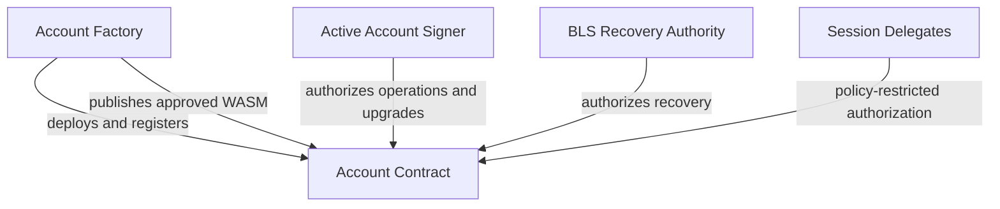

# Account Contract

The **Account Contract** is SocketFi's programmable smart account implementation for Soroban.

It implements Soroban's native custom-account interface and supports multiple account signer types, scoped session authorization, guardian-assisted recovery, emergency protection, and owner-approved contract upgrades.

## Overview

Each deployed contract represents an independent SocketFi account. The account controls its own authentication state and authorizes Soroban invocations through `CustomAccountInterface::__check_auth`.

The contract is responsible for:

- Authenticating account operations with a passkey, Stellar signer, or EVM signer
- Creating multiple concurrent, policy-restricted sessions
- Rotating the active account signer
- Recovering access through an aggregate BLS recovery authority
- Invalidating sessions after signer rotation or recovery
- Pausing a compromised account through authorized guardians
- Managing the account's guardian set
- Adopting factory-published account implementations with account authorization
- Extending the lifetime of account state through instance-storage TTL management

## Features

### Multiple Account Signer Types

An account is initialized with exactly one active signer:

- **Passkey** — WebAuthn-compatible P-256 authentication
- **Stellar** — Ed25519 authentication associated with a Stellar account
- **EVM** — secp256k1 authentication associated with a 20-byte EVM address

Signer-specific proofs of possession are verified before a signer is installed. Rotation and recovery atomically remove the previous active signer and install exactly one replacement signer.

### Passkey Authentication

- WebAuthn-compatible P-256 signatures
- Proof-of-possession verification during registration
- RP ID hash validation
- Passkey-based account authorization

### Stellar Authentication

- Ed25519 account signatures
- Stellar address and public-key validation
- Proof of control before signer installation
- Native Stellar account authorization where required

### EVM Authentication

- secp256k1 signature recovery
- Ethereum-compatible signed-message hashing
- Recovery-ID validation
- Derivation and verification of the expected EVM address

EVM signatures are chain-independent at the cryptographic level. The same EVM account can therefore authenticate the SocketFi account regardless of which EVM network the external signer interface is currently connected to, subject to application policy.

### Session Authorization

The account supports multiple concurrent sessions. Each session is stored independently under its policy ID, so creating a new session does not revoke existing sessions.

A session policy can restrict:

- Delegate public key
- Allowed contract functions
- Spend limits
- Usage limits
- Expiration ledger
- Session epoch

Sessions can be invalidated in two ways:

- **Individual revocation** — removes one policy by its `policy_id`
- **Global revocation** — increments the account's session epoch, invalidating every policy created under an earlier epoch

Signer rotation and account recovery increment the session epoch so that sessions authorized by a previous owner cannot remain active.

Session creation and revocation events can be indexed off-chain to provide account history, pagination, and session-management interfaces. Contract storage remains authoritative for authorization.

### Guardian Recovery

- Aggregate BLS recovery authorization
- Recovery without access to the current account signer
- Proof of possession for the replacement signer
- Atomic replacement of Passkey, Stellar, or EVM signers
- Global invalidation of previously issued sessions

The BLS recovery authority and the active account signer are separate concepts:

- `AccountSigner` identifies the signer used for normal account authorization.
- The aggregated BLS public key authorizes account recovery.

Recovery must not require authentication from the current account signer because that signer may be lost or compromised.

### Emergency Protection

- Authorized guardians can pause the account
- Normal account activity is blocked while paused
- Guardian approval is required before authenticated unpause
- Recovery remains available when the current signer cannot be trusted

### Guardian Management

- Add a guardian
- Schedule guardian removal
- Finalize removal after the configured delay
- Prevent immediate removal from bypassing the account's recovery assumptions

### Upgrade Support

Each account stores its originating factory address. The factory publishes the latest approved account WASM hash and version, while the account's active signer decides whether to adopt the upgrade.

This separates:

- **Protocol approval** — the factory identifies the official implementation
- **Account consent** — the account authorizes its own upgrade

Session authorization must never be allowed to approve an account upgrade.

The factory address is configured during construction and should not have a general setter. The factory registry can be used by integrations to confirm that an account is an official SocketFi deployment.

## Initialization

### `__constructor`

Initializes a newly deployed account.

The exact signer-registration input depends on the selected `AccountSigner` variant. Initialization also receives the account's recovery and guardian configuration.

During initialization, the contract:

1. Confirms that the account has not already been initialized.
2. Validates the selected account signer.
3. Verifies the signer's proof of possession.
4. Verifies each BLS recovery-key proof of possession.
5. Aggregates and stores the BLS recovery public key.
6. Stores the immutable factory address.
7. Stores the RP ID hash required for passkey verification.
8. Initializes the guardian set.
9. Initializes the session epoch.
10. Starts the account in the unpaused state.
11. Extends the instance-storage TTL.

Only one active account signer is installed at a time.

## Authentication

The contract implements Soroban's `CustomAccountInterface`.

Every authenticated Soroban invocation passes through:

```rust
fn __check_auth(
    env: Env,
    signature_payload: Hash<32>,
    signature: AccountAuth,
    auth_contexts: Vec<Context>,
) -> Result<(), AccountError>
```

`AccountAuth` selects the required verification path:

```rust
pub enum AccountAuth {
    Passkey(PasskeySignature),
    Stellar(StellarSignature),
    Evm(EvmSignature),
    Session(SessionAuthorization),
}
```

`__check_auth`:

1. Extends the account instance TTL.
2. Confirms that the selected signer type is configured.
3. Validates every authorization context.
4. Enforces pause and session-policy restrictions.
5. Verifies the relevant signature.
6. Authorizes the requested Soroban operation.

If authentication fails, Soroban rolls back the invocation, including its TTL extension.

Sensitive account-management functions—including signer rotation, session administration, guardian changes, and upgrades—must not be reachable through session authorization unless explicitly and safely designed otherwise.

## Account Lifecycle

### `rotate_account`

Replaces the current active signer under authorization from the account.

The function:

- Requires account authorization
- Validates the replacement `AccountSigner`
- Verifies proof of possession of the replacement signer
- Clears every existing active signer
- Installs exactly one replacement signer
- Increments the session epoch
- Emits a rotation event

Rotation preserves recovery configuration such as the RP ID hash, aggregated BLS key, factory address, and guardian set.

### `recover_account`

Replaces the active signer through the BLS recovery authority.

The function:

- Builds a domain-separated recovery challenge
- Binds the authorization to the account, replacement signer, and expiration ledger
- Verifies the aggregate BLS recovery signature
- Verifies proof of possession of the replacement signer
- Atomically clears and replaces the active signer
- Increments the session epoch
- Emits a recovery event

Recovery intentionally does not require authorization from the current account signer.

### `pause`

Allows an authorized guardian to pause the account immediately.

### `approve_unpause`

Records the guardian approval required before the account can resume normal activity.

### `unpause`

Removes the paused state after the required guardian approval and account authorization.

### `add_guardian`

Adds a validated guardian to the account.

### `schedule_guardian_removal`

Starts the delayed removal of an existing guardian.

### `finalize_guardian_removal`

Completes a scheduled guardian removal after the required ledger delay.

## Session Functions

### `create_session`

Creates a new session policy under a unique `policy_id`.

Creating a session does not revoke or overwrite another session unless the same policy ID is reused.

### `revoke_session`

Removes one session policy by its `policy_id`.

### `revoke_all_sessions`

Increments the account's session epoch, invalidating all policies issued under earlier epochs without iterating through them.

### Session discovery

Soroban contracts cannot enumerate storage keys or query historical events during execution. SocketFi therefore uses session events and an off-chain indexer to list sessions and session history.

The indexer is not an authorization source. A session is usable only when:

- Its policy still exists in contract storage
- It has not expired
- Its stored epoch matches the account's current session epoch
- Its function, spend, and usage restrictions permit the requested invocation

## Upgrade and Migration

### `migration_required`

Compares the account's installed WASM hash or version with the latest implementation approved by its stored factory.

It can return:

```rust
(bool, Option<BytesN<32>>)
```

where:

- `(false, None)` means the account is current.
- `(true, Some(latest_wasm))` means a newer approved implementation is available.

### `upgrade`

Adopts the factory-approved account implementation.

The function should:

- Require authorization from the account itself
- Reject session-based authorization
- Read the approved hash and version from the stored factory
- Reject stale or invalid versions
- Call `update_current_contract_wasm`
- Persist the installed version or hash
- Emit an upgrade event

The constructor does not run again after an upgrade. Any state transformation required by a new implementation must use an explicit, version-checked migration path.

Storage keys and encoded contract types must remain backward-compatible unless the migration intentionally transforms them.

## Read Functions

Depending on the exposed interface, read-only functions may include:

- `is_paused` — returns the current pause state
- `get_passkey` — returns the configured passkey, if active
- `get_stellar_signer` — returns the configured Stellar signer, if active
- `get_evm_signer` — returns the configured EVM address, if active
- `get_guardians` — returns the current guardian set
- `get_session_epoch` — returns the current global session epoch
- `get_session(policy_id)` — returns an individual session policy, if present
- `get_factory` — returns the originating factory address
- `migration_required` — reports whether a newer approved implementation exists

## Storage Model

### Instance storage

Long-lived account-wide configuration is stored in instance storage, including:

- Active account signer
- RP ID hash
- Aggregated BLS recovery public key
- Guardian configuration
- Pause state
- Session epoch
- Factory address
- Installed contract version or WASM hash

Instance storage is refreshed once at externally reachable execution paths such as construction, authentication, recovery, rotation, and guardian operations.

### Temporary session storage

Individual session policies are stored independently under keys such as:

```rust
SessionDataKey::Policy(policy_id)
```

Their TTL is aligned with their configured lifetime. Expired temporary entries disappear automatically.

The contract does not maintain an unbounded vector of all sessions. Session listing and history are derived from indexed events.

## Events

The contract should publish structured events for important state changes:

- Account initialized
- Session created
- Session revoked
- Session epoch changed
- Account signer rotated
- Account recovered
- Account paused
- Unpause approved
- Account unpaused
- Guardian added
- Guardian removal scheduled
- Guardian removed
- Account upgraded

Events support indexing and observability but do not replace contract-state validation.

## Security Model

The Account Contract provides layered protection:

- Mutually exclusive active account signer
- Signer proof-of-possession verification
- Domain-separated rotation and recovery challenges
- Authorization-context validation
- Aggregate BLS recovery authorization
- Emergency guardian pause
- Two-step unpause process
- Delayed guardian removal
- Per-session function, spend, usage, and expiry restrictions
- Individual and global session revocation
- Session invalidation after rotation and recovery
- Account-authorized, factory-approved upgrades
- Soroban-atomic signer replacement
- Consistent TTL management for account state

## Contract Relationships



## Design Principles

- Account-first terminology
- Soroban-native account abstraction
- Multiple authentication methods
- Exactly one active owner signer at a time
- Multiple concurrent scoped sessions
- Self-custodial account-authorized upgrades
- Guardian-assisted recovery
- Explicit separation between owner, session, guardian, and factory authority
- Atomic state transitions
- Indexer-assisted discovery with on-chain authorization
- Backward-compatible storage evolution

## Notes

- Account deployment is handled by the Account Factory.
- An account stores the factory address used for approved implementation discovery.
- A factory address stored by an account is not, by itself, proof of official deployment; integrations should also verify the factory registry.
- Recovery does not require the previous account signer.
- The RP ID hash is retained during signer rotation and recovery so that a passkey can be installed later.
- Creating a new session does not cancel existing sessions.
- Rotation and recovery globally invalidate earlier sessions by incrementing the session epoch.
- Failed Soroban invocations roll back storage changes and TTL extensions atomically.
- An upgrade preserves the contract address and existing storage, but it does not rerun the constructor.

## License

MIT
